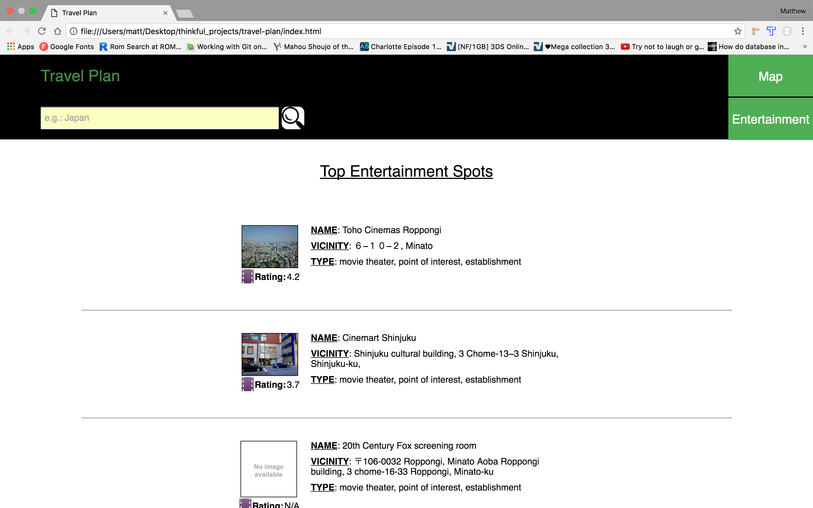

# Travel Plan

## Screens
![Map] (images/map-ss.png)  

  

![Events Screen] (images/events-ss.png)  

![Images] (images/images-ss.png)  

![Image Gallery] (images/image-gallery-ss.png)  

![Translator] (images/translator-ss.png)  

## Summary
The travel plan app is an application used to plan a trip ahead of time or while in the location you are traveling to. The app allows you to search a location. Based off of that location you will be able to view the top places and events nearby that previous people have enjoyed. You will also be able to view images of the area as well as use a language translator that can be used to translate english into the language of the current selected area.

##Technology
* This app was built using HTML5, CSS, Javascript, and jQuery
* Normalize.CSS was used as a css starting point
* The following APIs were used for map and location functionality:
	* Google Maps
	* Google Geocode
	* Google Places 
* The following API was used for event retrieval:
	* eventful API
* The following API was used for image retrieval:
	* Flickr API
* The following API was used for language translation:
	* Yandex Translate API
* The following API was used for country information lookup:
	* REST Countries
* The following jQuery plugin file was used for a read more... link
  being added to event descriptions:
  	* Shorten
	* https://viralpatel.net/blogs/demo/jquery/jquery.shorten.1.0.js
* The following plugin was used to create an image gallery slideshow:
	* blueimp Gallery
  